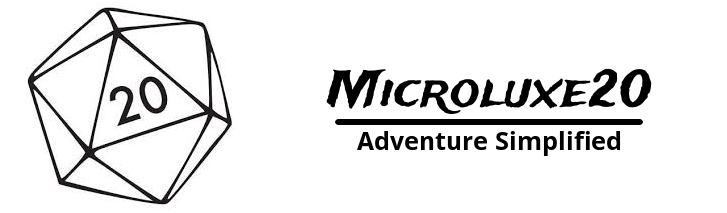

<p align="center">
  <a href="http://microluxe20.com"></a>
</p>

Microluxe20 is designed to be a stand-in replacement for any [SRD](https://en.wikipedia.org/wiki/System_Reference_Document) based tabletop adventure. The main goal is to utilize the simplicity of [Microlite20](http://microlite20.net/), while also adding various races, classes, and game-balancing tweaks. It also strives to clarify some of the more confusing parts of the Microlite20 system.

# Online Handbook
To dive right into the game, check out the following online resources:

[Complete Handbook](src/markdown/microluxe20_handbook.md)

[Terador Campaign Setting](src/markdown/microluxe20_lore.md)

[Map of Terador](https://raw.githubusercontent.com/kgrubb/microluxe20/master/map/Terador-complete.png)

[Races of Terador](src/markdown/microluxe20_races.md)

Microluxe20 features a pre-designed campaign setting, named "Terador" for ease-of-use. However, because of the simplicity of the rules, custom and homebrew campaign settings are very easy to implement. Definitely feel free to use your own setting, races, and other homebrew content!

# Downloads
The latest official release can be downloaded [here](https://github.com/kgrubb/microluxe20/releases/latest)!

# Contributing

**NOTICE:** _With the 7.0.0 release of markdown-pdf, compiling on Windows is currently broken (OSX/linux builds are working). While the document compiles, custom css isn't loading properly. The open issue can be found [here](https://github.com/alanshaw/markdown-pdf/issues/82)._

If you want to contribute to the game's handbooks, or want to craft your own custom release, please do the following:

### 1. Install Nodejs and npm

Node and NPM are used to build the PDF documents. You can find a link to node [here](https://nodejs.org/en/).

### 2. Fork the repository and clone locally

Contributions follow github's [pull request model](https://help.github.com/articles/using-pull-requests/).

### 3. npm install

First, run the following:

```sh
npm install -g gulp && npm install
```

This will globally install gulp, which is used for building the PDFs. It will also create a folder called node_modules, which will contain the dependencies used to build the PDFs.

### 4. Making changes and building PDFs

All of the rules are written in the __markdown__ files (found in the "src/markdown" directory). After making changes to these files, you can use the following gulp tasks to make new PDFs:

`gulp compile` - This will create a new folder named "documents" and will compile new PDFs.

`gulp watch` - This will automatically build PDFs whenever changes are saved to a markdown file located in the "src/markdown" directory.

`gulp release` - After running the `gulp compile` task, this task will craft a zipped folder with all of the latest released PDFs and documents. The completed release zip can be found in the "release" directory. The version number is determined by the version set in the `package.json` file.

### 5. Submit a pull request

Commit your changes and submit a new pull request to the microluxe20 develop branch.

# Authors & Contributors
* Keli Grubb (<keligrubb324@gmail.com>)
* Doug Rich
* Connor Bashinski

# Licensing
Licensed under the [Open Game License](LICENSE).
